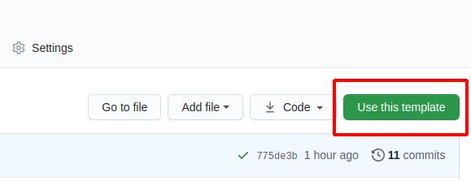
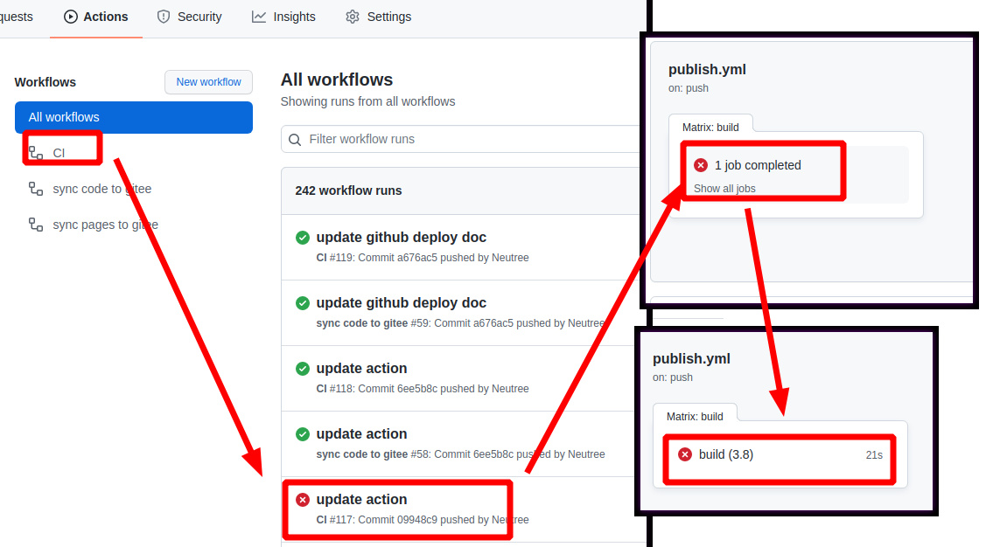
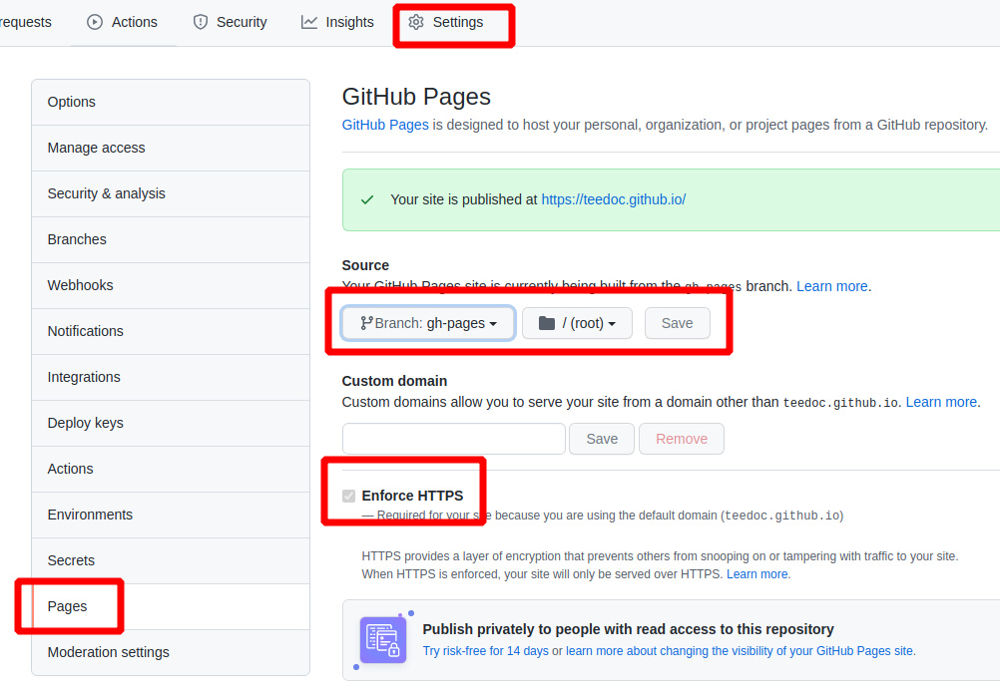

teedoc website template
=====

**[中文 README](./README_ZH.md) | English README**

test teedoc

This template supported by teedoc, visit: [teedoc.neucrack.com](https://teedoc.neucrack.com/) or [teedoc.github.io](https://teedoc.github.io) learn more


## build locally

* Install python3

On `Windows` or `macOS`, download from [python.org](https://www.python.org/downloads/)

On `Linux`, `Ubuntu` for example:

```
sudo apt install python3 python3-pip
```

* Install teedoc

This command will **install teedoc program**

```
pip3 install teedoc
```

* Initialize document

```
mkdir my_site
cd my_site
teedoc init
```

or

```
teedoc -d my_site init
```

* Install plugins

This command will **install plugins** used by doc(set in `site_config.json`)

```
cd my_site
teedoc install
```

* build or serve

```
teedoc serve
```

then visit [http://127.0.0.1:2333](http://127.0.0.1:2333) in browser

If you only want to generate htmls:

```
teedoc build
```


## Create your website on github pages in minutes


### Create a repository based on a template

* Visit [https://github.com/teedoc/template](https://github.com/teedoc/template) or [https://github.com/teedoc/teedoc.github.io](https://github.com/teedoc/teedoc.github.io), click `Use this template`




* Set the name of the new repository to `username or organization name.github.io`, select the public repository, and then confirm the submission


> Then use `git clone your repository address` to clone to the local

### Set up pages service

* Wait for the automatic build to generate a new branch `gh-pages`, you can click on the `Actions` column to view the progress of the automatic build, if a green tick appears, it means it is OK, if a red cross appears, the build fails Yes, where is the problem, you can click in to view the log according to the screenshot method below (you must submit a screenshot of the log) and submit [issue](https://github.com/teedoc/teedoc.github.io/issues/ new) feedback


If there is an error, you can click to view the error log according to the following figure:



* Set the `pages` service of the repository and select the `gh-pages` branch. If there is no such branch, the previous step has not been completed or an error occurred. You can view the issue submission [issue](https://github.com/ teedoc/teedoc.github.io/issues/new) feedback


* Then visit `username or organization name.github.io`, you will find a webpage, the content is exactly the same as `teedoc.github.io`!


